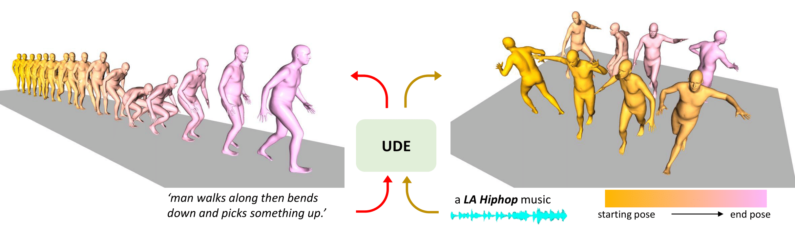
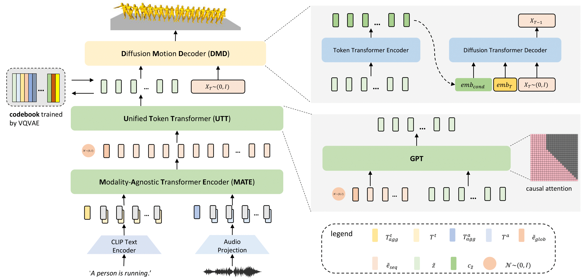

# Project page of "UDE: A Unified Driving Engine for Human Motion Generation"

✨✨✨ Our paper has been accepted by CVPR2023

---

## [Project Website](https://zixiangzhou916.github.io/UDE/), [Paper](http://arxiv.org/abs/2211.16016), [Demo](https://www.youtube.com/embed/CaG1PTvzkxA)

---

Our shared Unified Driving Engine (UDE) can support both text-driven and audio-driven human motion generation. Left shows an example of a motion sequence driven by a text description while Right shows an example driven by a LA Hiphop music clip 

# Abstract
#### Generating controllable and editable human motion sequences is a key challenge in 3D Avatar generation. It has been labor-intensive to generate and animate human motion for a long time until learning-based approaches have been developed and applied recently. However, these approaches are still task-specific or modality-specific. In this paper, we propose “UDE”, the first unified driving engine that enables generating human motion sequences from natural language or audio sequences. Specifically, UDE consists of the following key components: 1) a motion quantization module based on VQVAE that represents continuous motion sequence as discrete latent code, 2) a modality-agnostic transformer encoder that learns to map modality-aware driving signals to a joint space, and 3) a unified token transformer (GPT-like) network to predict the quantized latent code index in an auto-regressive manner. 4) a diffusion motion decoder that takes as input the motion tokens and decodes them into motion sequences with high diversity. We evaluate our method on HumanML3D and AIST++ benchmarks, and the experiment results demonstrate our method achieves state-of-the-art performance

# Overview
#### Our model consists of four key components. First, we train a codebook using VQ-VAE. For the codebook, each code represents a certain pattern of the motion sequence. Second, we introduce a ModalityAgnostic Transformer Encoder (MATE). It takes the input of different modalities and transforms them into sequential embedding in one joint space. The third component is a Unified Token Transformer (UTT). We feed it with sequential embedding obtained by MATE and predict the motion token sequences in an auto-regressive manner. The fourth component is a Diffusion Motion Decoder (DMD). Unlike recent works, which are modality-specific, our DMD is modality-agnostic. Given the motion token sequences, DMD encodes them to semantic-rich embedding and then decodes them to motion sequences in continuous space by the reversed diffusion process.

# Demo

#### We show a short demo video on how our model can generate motion sequence with mixed modality of inputs. To watch full demo video, please visit this site: (https://www.youtube.com/embed/CaG1PTvzkxA)

<video src="./assets/v1.mp4" controls="controls" width="1920" height="1080"></video>

# Code comming soon!

# Citation

@InProceedings{Zhou_2023_CVPR, \
$\qquad$ author    = {Zhou, Zixiang and Wang, Baoyuan}, \
$\qquad$ title     = {UDE: A Unified Driving Engine for Human Motion Generation},\
$\qquad$ booktitle = {Proceedings of the IEEE/CVF Conference on Computer Vision and Pattern Recognition (CVPR)},\
$\qquad$ month     = {June},\
$\qquad$ year      = {2023},\
$\qquad$ pages     = {5632-5641} \
}